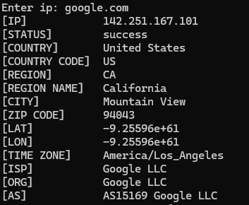

# Boost IP Tracker

A simple C++ project that takes an IP address or web address and displays detailed geolocation and network information using an external API.

---

## API Used

This project uses [ip-api.com](http://ip-api.com/) to fetch IP geolocation data.

---

## Example

Click to enlarge:

<a href="assets/example1.png" target="_blank">
  
</a>

---

## Tested On

- **Windows 10** (Visual Studio 2022)
- **Ubuntu** (g++ 13.3.0)
- **CMake** (version 3.29)

---

## Dependencies

### Boost Library ([boost.org](https://www.boost.org/))

#### Linux

```bash
sudo apt install g++ make binutils cmake libboost-system-dev
```
#### Windows (via vcpkg)  
1. Setup vcpkg
```powershell
git clone https://github.com/microsoft/vcpkg
.\vcpkg\bootstrap-vcpkg.bat
```
2. Setup boost
```PowerShell
.\vcpkg.exe install boost
```

## Building  
```bash
mkdir build
cd build
cmake ..
cmake --build .
```
---
Feel free to copy, modify, and use this project however you like. No strings attached! 😎
